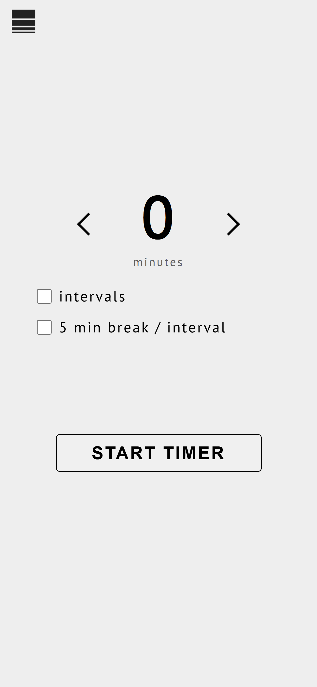
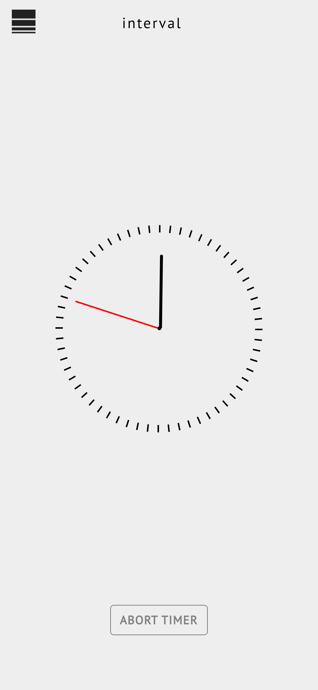
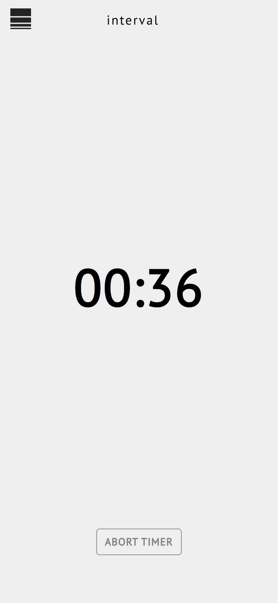
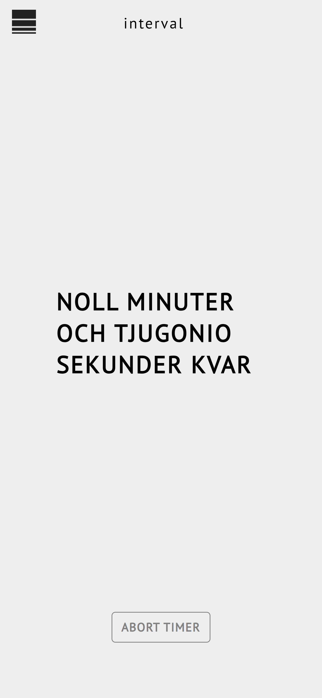
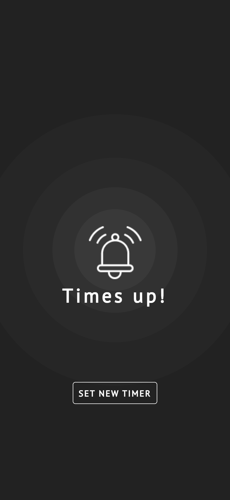

# Interval Timer App

An interval timer app that lets users manage custom timers with optional break intervals. The app provides multiple visual clock formats (analog, digital, and text) and allows switching between continuous and paused intervals based on user settings.

## Features

- **Customizable Timer**: Set the initial duration (minutes and seconds) for your timer.
- **Break Functionality**: Option to enable breaks between intervals for recovery or rest periods.
- **Multiple Clock Views**: Seamlessly switch between analog, digital, and text-based clocks.
- **Alerts and Reminders**: Visual alerts notify users when a timer reaches zero.

## Tools and Technologies

- **React**: Frontend framework for building user interfaces.
- **TypeScript**: Strong typing to enhance code quality and maintainability.
- **EasyTimer**: Timer management for counting down intervals and handling custom break times.
- **React Router**: Manages route-based navigation within the app.
- **Vite**: Fast development server and build tool optimized for modern frontend projects.
- **CSS**: Custom styling for a clean, responsive user experience.

## Installation

To run the project locally, follow these steps:

1. **Clone the Repository**
   ```bash
   git clone https://github.com/your-username/interval-timer-app.git
   cd interval-timer-app
   ```
2. **Install Dependecies**

```
npm install
```

3. **Start the Development Server**

```
npm run dev
```

## Usage

- Enter the desired minutes and seconds on the timer setup screen.
- Optionally, select the break functionality if you want breaks between intervals.
- Start the timer, and click on the clock to switch between analog, digital, and text views.

## Screenshots

### Loading Page


### Set Timer Page



### Analog View



### Digital View



### Text View



### Alarm



## Future Enhancements

- Customizable break duration and interval settings.
- Save timers for easy reuse.
- Sound notifications on interval completion.

## Contributing

If you’d like to contribute to this project, please fork the repository, open a pull request, or report issues via the Issues tab.
